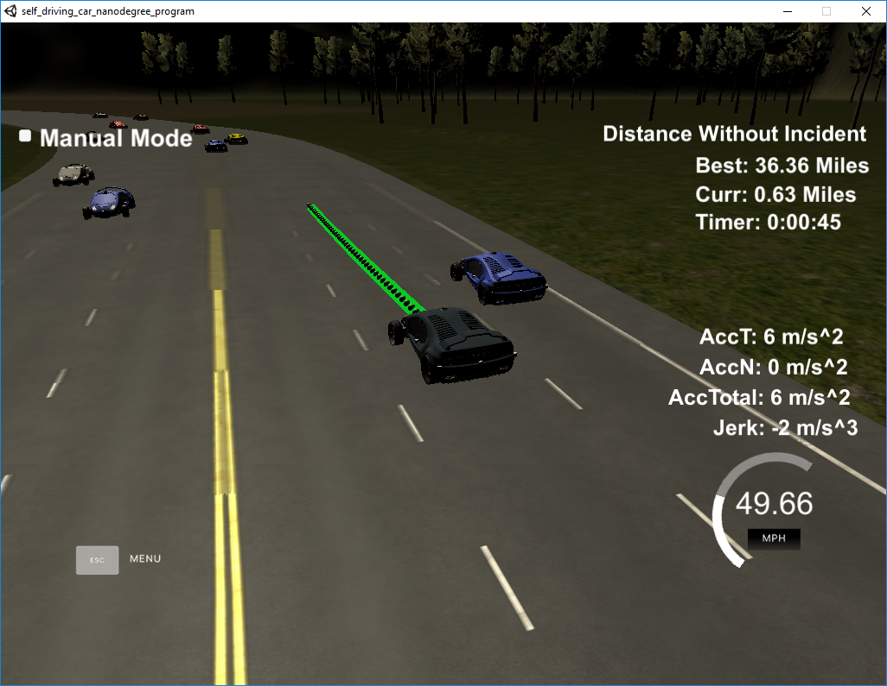

# Path Planning Project

The goal of this project was to implement a system to plan the trajectory of a simulated car as it drives along a highway.

## [Rubric](https://review.udacity.com/#!/rubrics/1020/view) Points
### Here I will consider the rubric points individually and describe how I addressed each point in my implementation.  

---

### Compilation

#### The code compiles correctly.

The code compiles using cmake and make commands as described in project instructions.

### Valid Trajectories

#### The car is able to drive at least 4.32 miles without incident..

*The top right screen of the simulator shows the current/best miles driven without incident. Incidents include exceeding acceleration/jerk/speed, collision, and driving outside of the lanes. Each incident case is also listed below in more detail.*

Verified by execution.

#### The car drives according to the speed limit.

*The car doesn't drive faster than the speed limit. Also the car isn't driving much slower than speed limit unless obstructed by traffic.*

Verified by execution.

#### Max Acceleration and Jerk are not Exceeded.

*The car does not exceed a total acceleration of 10 m/s^2 and a jerk of 10 m/s^3.*

Verified by execution.

#### Car does not have collisions.

*The car must not come into contact with any of the other cars on the road.*

Verified by execution.

#### The car stays in its lane, except for the time between changing lanes.

*The car doesn't spend more than a 3 second length out side the lane lanes during changing lanes, and every other time the car stays inside one of the 3 lanes on the right hand side of the road.*

Verified by execution.

#### The car is able to change lanes

*The car is able to smoothly change lanes when it makes sense to do so, such as when behind a slower moving car and an adjacent lane is clear of other traffic.*

Verified by execution.

### Reflection

#### There is a reflection on how to generate paths.

*The code model for generating paths is described in detail. This can be part of the README or a separate doc labeled "Model Documentation".*

My code consists of the following modules:

* Tools - This class encompasses the utility functions that were provided in main.cpp originally. It makes accessing these functions more portable.
* PathPlanner - This class encompasses my path planning and trajectory generation and is where the bulk of my code is implemented.
* Main - Pretty much as provided except for a couple of changes which are marked out in "USER CODE" sections.

##### Trajectory Generation

The first problem I tackled was to get the vehicle to drive along the centre line of the track using the map waypoints provided and Frenet coordinates. Once this was working I shifted the car position to be in the centre of the middle lane driving in the appropriate direction.

Having accomplished this I set about smoothing the trajectory driven to try to reduce the jerk experienced by the car. I did this by making use of cubic spline interpolation header file ([spline.h](./src/spline.h)). The implementation of my trajectory generation is in the ```PathPlanner::CalculateTrajectory``` function.

To use the spline fit I generated a couple of points for the end of the cars current planned trajectory. This constrains the start position and heading for the spline. I then calculate three more points spaced 30m apart further down the track. 

Having calculated the spline fit in world coordinates I transform them into the cars reference frame. I then start from the end of the current trajectory plan and incrementally add points to the trajectory following the calculated spline and accelerating/decelerating the vehicle as requesting by the behaviour planner.

Once this was complete the car was driving much more smoothly around the track and was no longer violating the jerk constraints, but was crashing into the first car it met in the middle lane.

##### Behaviour Planning

Now that I had a trajectory generator I moved on to behaviour planning. The code for this is in the ```PathPlanner::DetermineNextAction()``` function.

I ended up implementing a Finite State Machine (FSM) with the following states:

* Keep Lane
* Lane Change Left
* Lane Change Right
* Prepare Lane Change Left
* Prepare Lane Change Right

To decide which state I should be in at any given time I implemented a number of rules (rather than an explicit cost function approach, although the result is very similar).

For each state there are rules to govern the target speed and lane for the car as well as whether the car should change lane. Key rules were as follows:

* Speed of the car should be limited based on predicted position and speed of surrounding cars
* If not already travelling at maximum speed then we should change lane if an adjacent lane is moving faster (based on speed of surrounding cars)
* If not already travelling at maximum speed and adjacent lane speed is similar to current lane speed then check the far lane speed to see if we should change lane ready to move into the far lane.
* Don't change lane unless there is a large enough gap for the manoeuvre.
* If there isn't enough space then prepare for the lane change by dropping back until we find a gap to change into.
* If we have the option of changing into two lanes and both are currently clear then move into the one which the biggest gap ahead to the next vehicle.

I found that with these rules in place the vehicle behaved in a sensible manner in most situations and was able to drive around the highway changing lanes as required for around 36 miles (at which point another driver changed lanes and crashed into the side of me). Below is a screenshot showing this result:



There are a number of parameters used for these rules which are defined at the top of [path_planner.h](./src/path_planner.h).

##### Improvements

There are a number of improvements that would be worth investigating:

* Instead of just using position or velocity to decide whether to change lanes should instead calculate how far we can travel in the next X seconds for each option and choose the option that will progress the car the furthest.
* Check for cars changing lanes when looking for collisions - currently I only consider velocity in s-direction, not d-direction.
* Add some logic to bail out of a manoeuvre if it isn't working as planned. At the moment once we decide to do something that is the end of that and we will do it regardless. For instance if preparing to change lane and then cars keep stacking up in the lane we want to change into. In this case we will keep dropping further and further back whereas we might be better to abandon the lane change and keep in our lane.